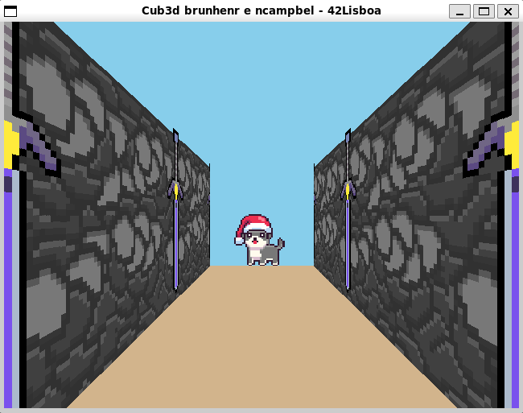

# My first RayCaster
 Summary: This project is inspired by the world-famous Wolfenstein 3D game, which
 was the first FPS ever. It will enable you to explore ray-casting. Your goal will be to
 make a dynamic view inside a maze, in which you’ll have to find your way.

 To do this, we used MinilibX, which is a simplified library based on X-System.

 Project developed by me and https://github.com/nyykooo  

 You can walk through the maze using the keys "w", "s", "a" and "d".
 If you hold the keys "shift" + "w" the player will run.  

  Bonus list:  

	-Wall collisions.  
	-A minimap system.  
	-Doors which can open and close. (use the key "e" to open and "c" to close)  
	-animated sprite.  
	-Rotate the point of view with the mouse.  

